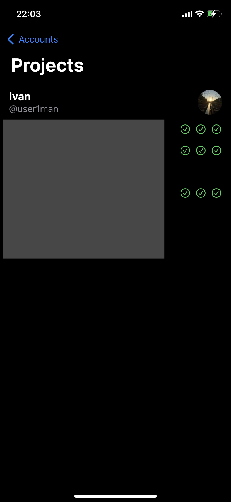

# Lab-CI
Привет!
Lab-CI это рабочее название моего pet-приложения.
Данное приложение позволяет просматривать информацию об автоматизированных сборках Gitlab CI/CD.
К примеру, можно увидеть результат выполнения важной задачи, или понять какая из работ привела к сбою сборки прямо из приложения на iPhone (что полезно, когда устройство не под рукой).

Приложение в настоящее время находится в разработке, потому исходный код не доступен.

Планируемый функционал:
- [x] Просмотр репозиториев (проектов)
- [x] Просмотр Pipelines для репозитория
- [x] Просмотр подробностей о выполнении Jobs внутри конкретного Pipeline
- [x] Анимации внутри приложения
- [x] Поддержка универсального доступа
- [x] Поддержка нескольких токенов авторизации
- [ ] Уведомление о выполнении отдельной сборки

Проект разрабатывается на Swift UI

Немного скриншотов:
 

